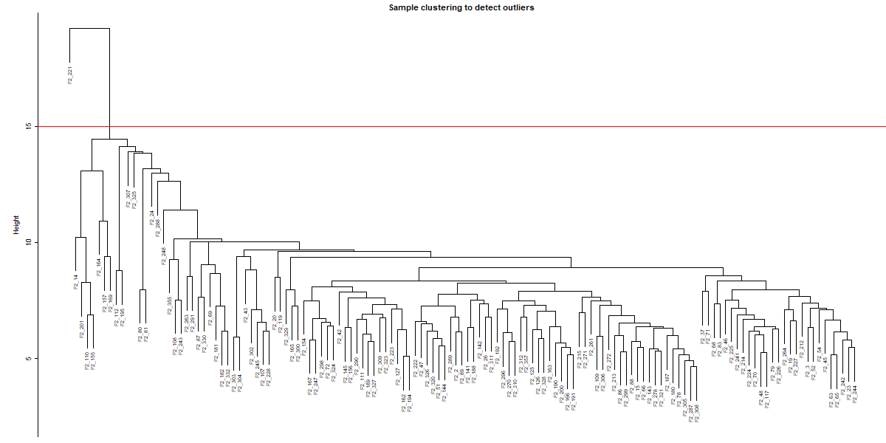
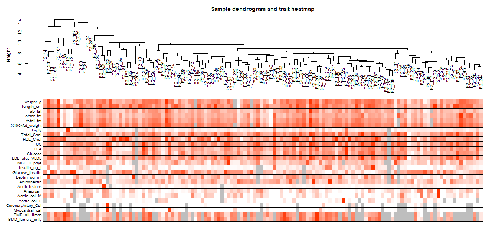
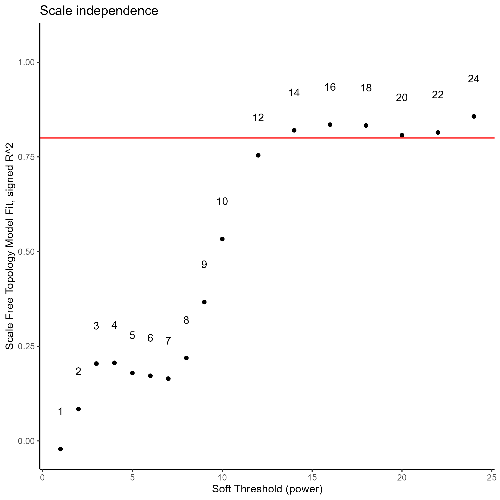
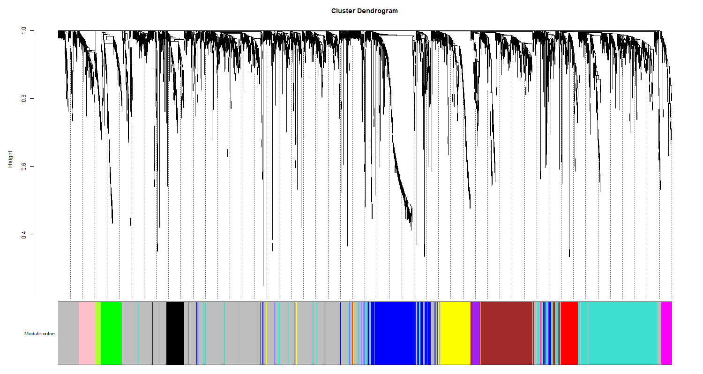
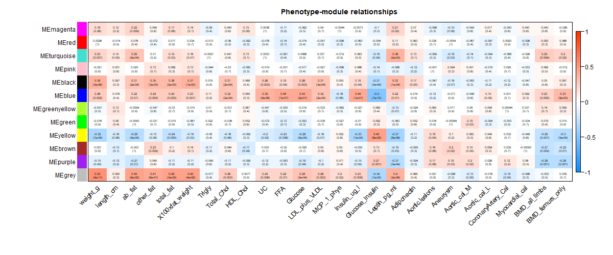

```{r setup, include=FALSE}
knitr::opts_chunk$set(echo = TRUE)
```

## **Introduction**

Around the 19th century, Gregor Mendel found a relationship between genetics and traits. Starting from this statement, with the pass of the years science has sought to dig deeper into this area, which has lead to approaches as systems genetics. It integrates systems biology and genetics in order to find relationships between genotype and phenotype information in complex traits (@Nadeau2011).

With this in mind, an study was conducted to find relationships between genetic determinants of metabolic syndrome (obesity, insulin resistance, and dyslipidemia) (@Ghazalpour2006) and liver gene expression in an F2 intercross of 135 female mice, by using co-expression networks (@Wang2006).

## **Material and Methods**

Since all the animals and tissue collection, RNA preparation and microarray hybridization were developed by other authors (@Wang2006), this section will focus on the computation analysis executed.

Concerning the data, it was used microarray and genetic marker data from the F2 intercross and there were taken into account 22 physiological traits and 3600 genes.

#### **Data filtering and merging information**

On the first place, it was developed the data filtering concerning the gene expression data set *LiverFemale3600.csv* and the genotype associated dataset *ClinicalTraits.csv.* For both data sets, the columns that did not give relevant information for the analysis as IDs, for example, were deleted. Then, we looked for missing entries and low values on the gene expression data set and filtered. After filtering the data itself, we checked for outliers by using hierarchical agglomerative clustering. This analysis gives us a cut height, that is the outliers' starting point (Figure 1), so we filtered the samples taking this into account and from here to the end we worked with this reduced data set. Now, with the idea of finding relationships, it is important to have the same samples in both of them, so we matched data sets and then, with this new related information, we created a new sample dendogram and we linked it to a trait heatmap (Figure 2). At this point, we have a first intuition on samples and traits relationships.

#### **Network construction**

In order to construct the co-expression network, it is important to execute a prior analysis of scale free topology for multiple soft thresholding powers. This kind of analysis allows us to find the right power to create the network, so we can power the correlation of the genes to that value, leading to a reduction on noise of the correlations (@sancho_jol_espinoz).

After finding the soft threshold power (Figure 3), the network is constructed and modules are detected based on genes connectivity (clusters).

#### **Relating genes and traits**

Now that the genes are clustered as modules, the eigengenes (representative gene of each module) are found in order to compare the modules and then the dendogram with modules' specific colors is generated (Figure 4). When having all the eigengenes related information, it is possible to create a correlation matrix between modules and traits (Figure 5).

## **Results**

#### **Data filtering and merging information**

```{r , echo=FALSE, fig.cap = "Figure 1. Sample clustering dendogram. The horizontal red line presentes the threshold from where a sample is considered and outlier. ", out.width=1200, out.height=400}

```

On figure 1 it is presented a sample clustering dendogram for the samples. It can be seen that above a height of 15 it is the sample F2_22, which means this is the outlier.

```{r , echo=FALSE, fig.cap = "Figure 2. Filtered sample dendogram and trait heatmap. Low values are represented on white, high values on red and nule on grey.", out.width=1500, out.height=500}

```

On figure 2 it is presented the sample dendogram without the oulier and the related trait heatmap. It can be seen that for most of the traits the sample present high values, except for the heart related ones.

#### **Network construction**

<center>

```{r , echo=FALSE, fig.cap = "Figure 3. Scale free topology model fit to find the ideal soft threshold power.", out.width=350, out.height=350}

```

</center>

On figure 3 it is presented the scale free topology model fit. It can be seen that the last value below 0.8 is 12, which means this is our selected power for constructing the network.

#### **Relating genes and traits**

```{r , echo=FALSE, fig.cap = "Figure 4. Cluster dendogram associated with module colors.", out.width=1200, out.height=350}

```

On figure 4 it is presented the cluster dendogram and the associated module colors of the genes. On this figure it is possible to see how genes are clustered on modules, based on the eigengenes, and the colors associated to them.

```{r , echo=FALSE, fig.cap = "Figure 5. Correlation matrix between modules and traits.", out.width=1500, out.height=400}

```

On figure 5 it is presented the correlation matrix between phenotypes and modules.

## **Discussion**

On the first place, it was found that out of the 135 samples, just one was identified as an outlier. Also, when looking at the heat map related to samples, it was seen that the traits associated to heart (myocardial_cal, CoronaryArtery_Cal, Aortic_Cal_L, Aortic_Cal_M, etc) presented low or nule values to most of the samples. Also that, fat related presented high values. Now, when looking at the correlation matrix it is seen that the grey, blue and black module present a similar behavior. Also, since the fat related traits present high values on the correlation matrix, to these modules, it would be a good future work to undergo a gene ontology enrichment analysis.

## **References**

::: {#refs}
:::
